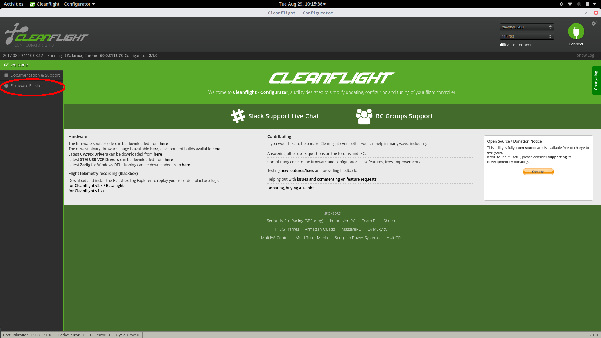

# Install Guide for Cleanflight and Control via MSP
The Skyline 32 is the flight controller; it has an onboard accelerometer and gyroscope, and sends commands to the ESCs. We compile the firmware (called CleanFlight) with an option that allows us to control the Skyline via USB.

## Compiling Firmware For Skyline32

Download the firmware source code at [https://github.com/cleanflight/cleanflight](https://github.com/cleanflight/cleanflight) and compile with

`make arm_sdk_install`

`make NAZE OPTIONS=USE_MSP_UART`

There is a [pre-compiled hex](https://github.com/h2r/pidrone_pkg/blob/feature/instructions/instructions/cleanflight/cleanflight_2.1.0_NAZE.hex) located in the pidrone_pkg github, which can also be used.

## Flashing Fimware

1. Plug the skyline into the computer via USB. If your skyline is already on a drone, do not connect the battery. 

2. Open [cleanflight configurator](https://chrome.google.com/webstore/detail/cleanflight-configurator/enacoimjcgeinfnnnpajinjgmkahmfgb)
and go to the "Firmware Flasher" tab.  This tab is before you connect to the base station. 

 

3. Click "Load Firmware \[local\]" and load your custom firmware file from 
`cleanflight/obj/cleanflight_x.y.z_NAZE.hex`

4. Click the "Flash Firmware" button to flash the flight controller.

5. If this is a success, the bar at the bottom will say "Programming: 
SUCCESSFUL" and you are ready to move to the next step.

## Configuration Options

1. Plug in Skyline and click "Connect"

2. Go to "Ports" tab and make sure SerialRX for UART2 is disabled and click "Save and Reboot"

3. Go to "Configuration" tab 

    a. Flip the yaw by 180 degrees and click "Save and Reboot"

    

    b. Also change the receiver to "MSP_RX" and click "Save and Reboot"

    

4. Go to the "Receiver" tab and change the input map to "AERT1234" and click "Save"

5. Go to the "Modes" tab

    a. Under "Angle", click "Add Range"

    

    b. Drag the sliders so that the range spans from 900 to 2100

    

    

    c. Click "Save"

6. Go to the "PID Tuning" tab

    a. Change the "ROLL" and "PITCH" PID terms to match the image

    

    b. Change the "Angle Limit" to 50

    

    c. Click "Save"

7. Plug the skyline back into the Pi and you should be set to fly!

## Other Options

### Battery Monitoring and Voltage Compensation
_Coming soon..._

### Throttle Angle Compensation

Go to "CLI" tab and type

`set thr_corr_value = XX` and `set thr_corr_angle = YY`

This will set it (linearly?) so that it adds `XX` to the throttle when at angle `YY`
