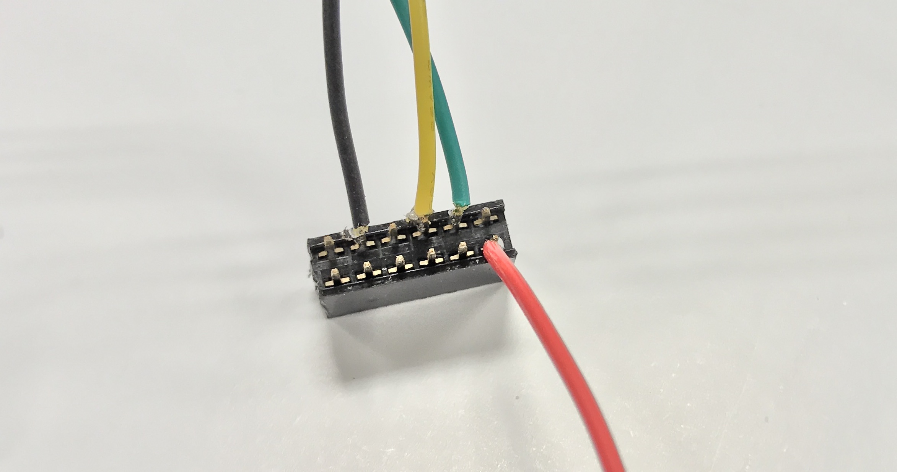
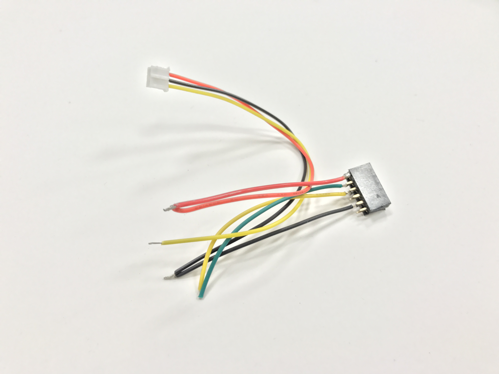

## Sharp Infrared Range Finder

The sharp IR sensor shoots out an infrared beam and measures distance by the angle at which that infrared light is bounced back. 

It is an _analog_ sensor, which means that it outputs a range of voltages to indicate its measurement, as opposed to a _digital_ signal (1s and 0s). Unfortunately, the Raspberry Pi 3 does not have any way to read analog values, so we need a device to convert the analog voltage to a digital signal we can make sense of... 

Enter the Analog to Digital Converter (ADC)!

This nifty little device can read four analog signals (A0 - A4) and outputs a digital protocal (i2c) which the Pi can read.

### The Pi Header

Cut red, yellow, green, and black 24 AWG stranded wires to **4 inch** lengths. Strip about 0.5 cm on either side and tin both sides. 

Solder the wires to your 2x6 female header as shown in the image below. Be careful not to short adjacent pins.

Take your infrared connector cable and cut it to **7 inch** length leaving the white stubby connector on. Strip 0.5cm.

Twist the black and red wires from your connector and from your header together as shown.

Now solder your two connectors to the ADC.

