## Hardware Assembly

### Check your components
  Before you start assembling your drone, it's important to make sure you have the right components. For the hardware assembly, you will need:
  
* 4 ESCs (Electronic Speed Controllers). These convert DC power from the battery to [three-phase AC](https://en.wikipedia.org/wiki/Three-phase_electric_power), which drives the motor at the desired speed.

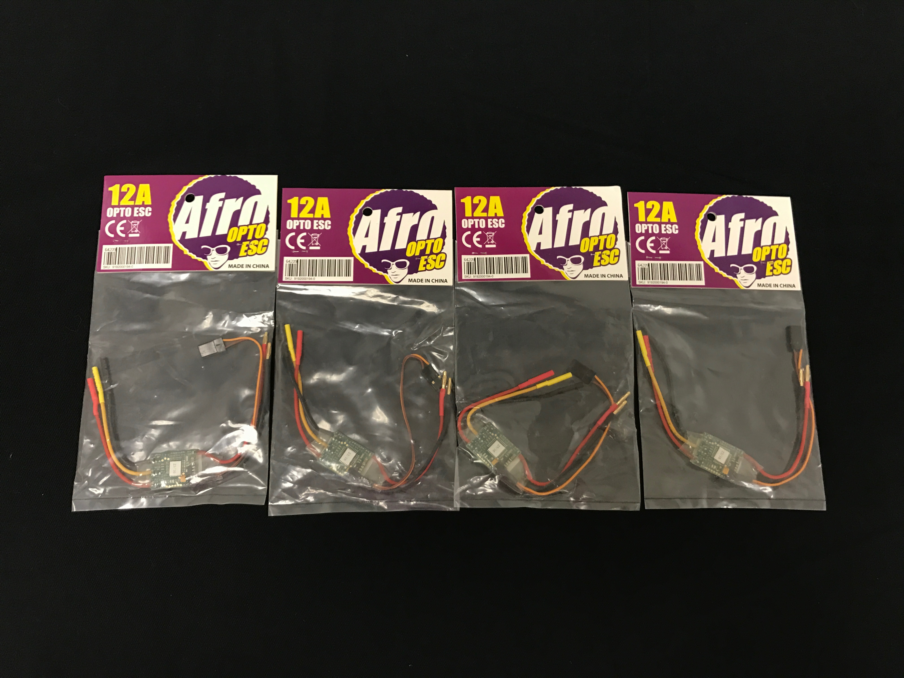

* 4 Motors. These brushless motors are driven by three phase AC (hence the three wires). On the bottom of the boxes, you will notice a part number of the form SE1806-***_XY_***, where ***_X_*** is either 11 or 13, and ***_Y_*** is either CW or CCW. The ***_X_*** refers to the number of coils inside the motor. Make sure all of your motors have the same ***_X_*** so they spin at the same speed. The ***_Y_*** refers to clockwise or counter clockwise. You need two of each.

* 4 Props. Your bag should contain 2 CW and 2 CCW propellers.

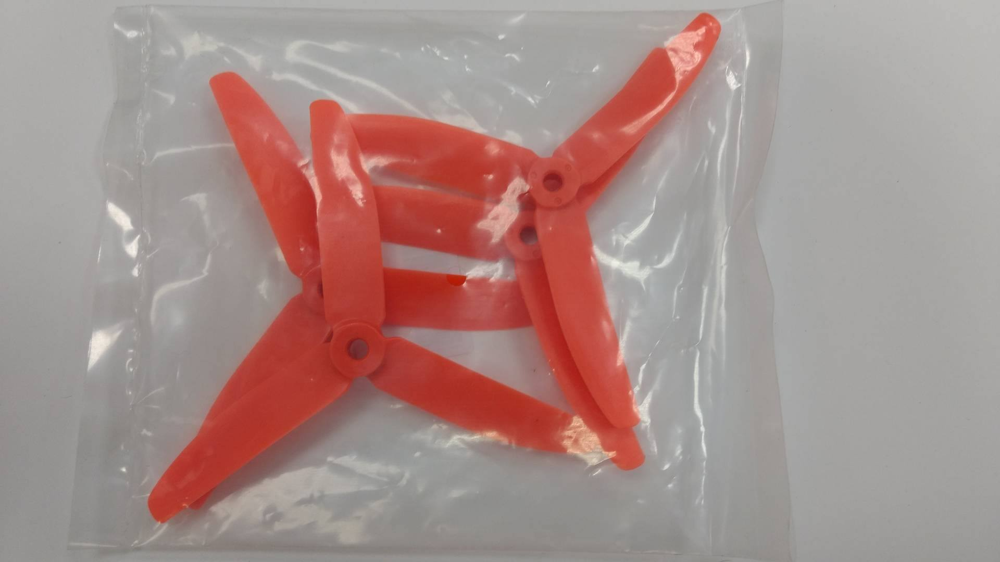

* 1 frame kit. This is the skeleton of your quadcopter.

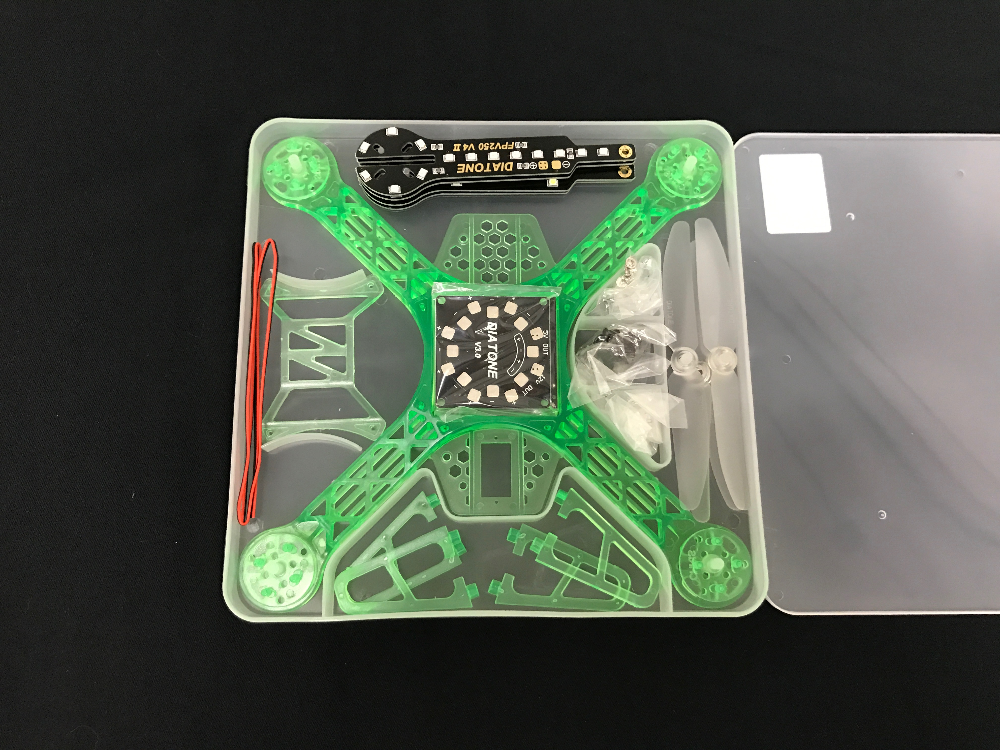

* 1 Power Distribution Board (PDB). This lets you distribute power from the battery to the motors and the Raspberry Pi.

* 1 Battery lead. This will let you connect a battery to the PDB.

* 1 Skyline box

* 1 Raspberry Pi

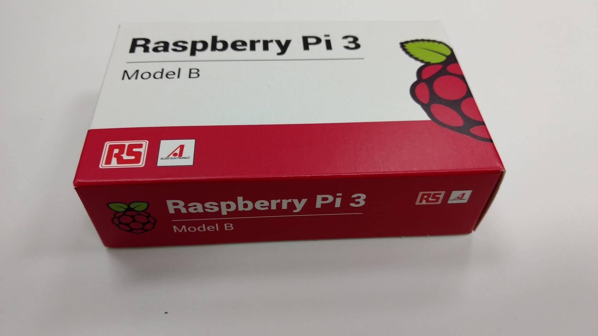

* 1 Battery Elimination Circuit (BEC). This is a 5V [switching regulator](https://www.dimensionengineering.com/info/switching-regulators) used to power the Pi.

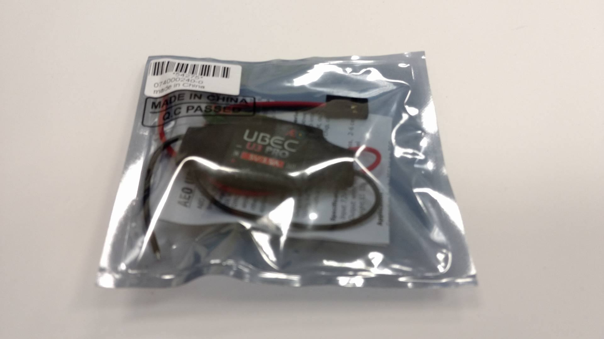

* 1 IR sensor

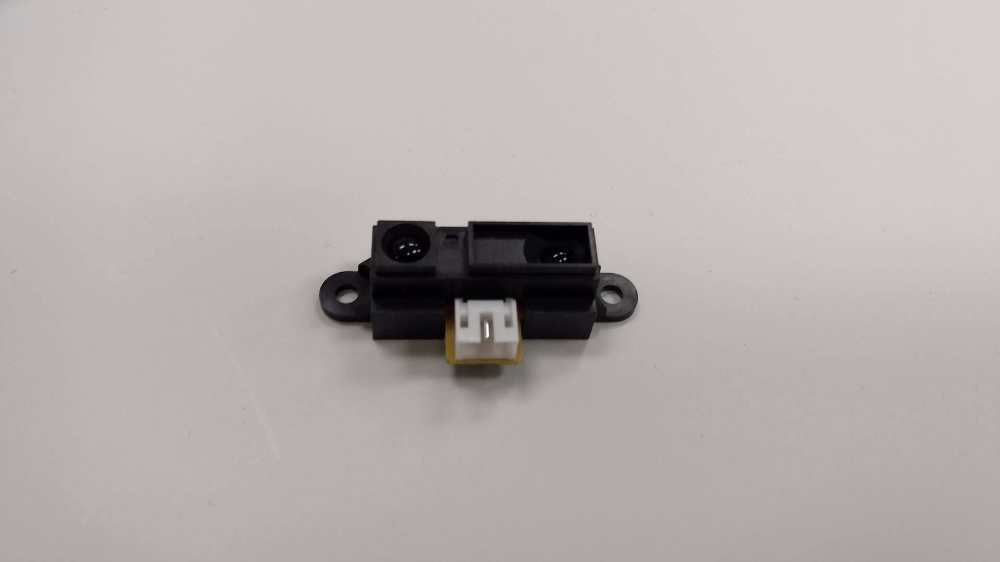

* 1 camera

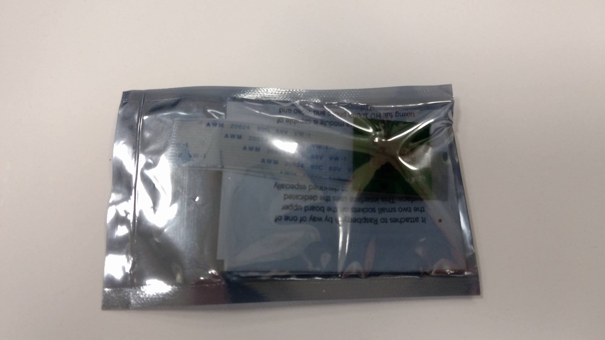

* 4 standoffs, with 4 M3 bolts

* 3mm heatshrink (cut into 12, 1cm pieces)

* 4 zipties

### Bolt on the Motors
Two of the motors are counter-clockwise threaded and the other two are clockwise threaded. Screw the included nuts that came each motor onto the motor shaft so you don't forget which is which. 

TODO: Add image in next line

The motors with the red nuts will spin counter-clockwise and the black clockwise, so it is critical that they are attached to the correct arms. Image REF shows which side of the frame is the front. The front right motor will spin CCW, and the front left motor will spin CW. Diagonal motors spin in the same direction. The next image shows how the propellers will spin:

In order to ensure the nuts tend to tighten during flight instead of loosen, you want each nut to thread in the opposite direction as its motor spins. For example, this means the front right motor's nut should tighten in the CW direction. When mounting the motors, make sure to route the wire through the hole in the frame to the underside of the frame _before_ bolting on the motor. 

Use two of the long M3 bolts included with the motor and screw them in tightly.

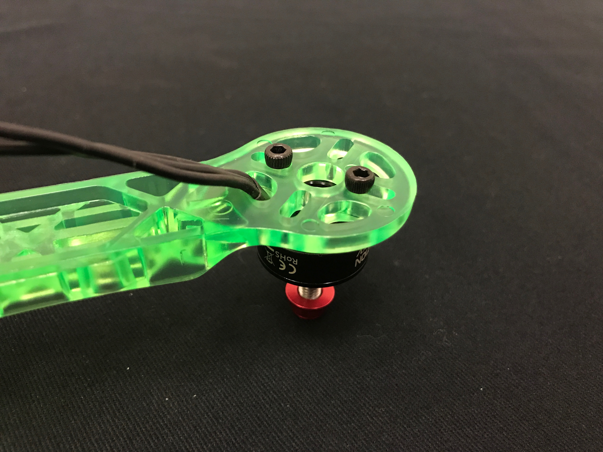

Screw the short M3 bolts into the brass 6mm M3 standoffs.

Use a hex key to screw the standoffs through the PDB into grooves in the frame in the shown orientation. Apply a downward pressure as you are turning to ensure the standoffs bite into the plastic. Be careful not to overtighten the standoffs and strip out the groove.

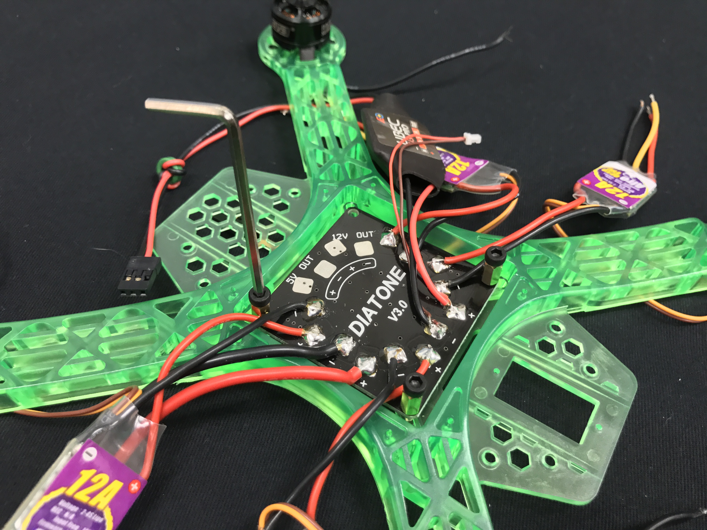

### Solder ESCs to Motors

Place your 3mm diameter heatshrink tubing cut to 1cm sections onto each of the motor leads.

If you have not done so already, you will need to cut off the connectors on the ends of the ESC wires, and strip the plastic casing. You need to do this for the two input wires and the three output wires, as shown in the picture:

Tin the ESC wires thoroughly if you haven't already. Tin the motor wires as well. (Note: They come pre-tinned, but with a different, higher temperature solder and not quite enough of it)

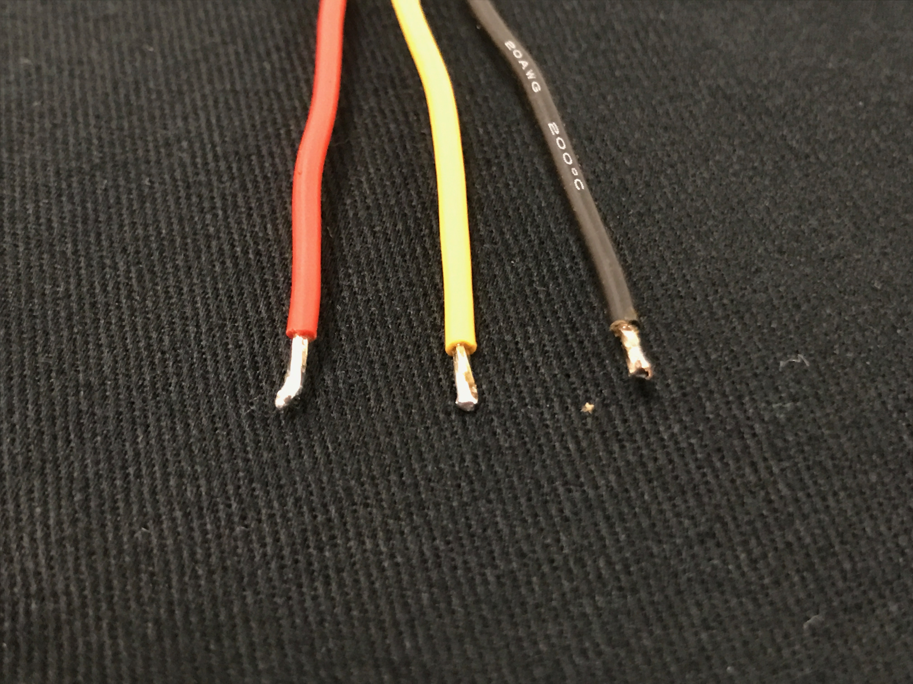

Solder the ESC wires to the motor wires. It does not matter which ESC wire is connected to which motor wire. However, routing will be easier if you make sure they are not too twisted.

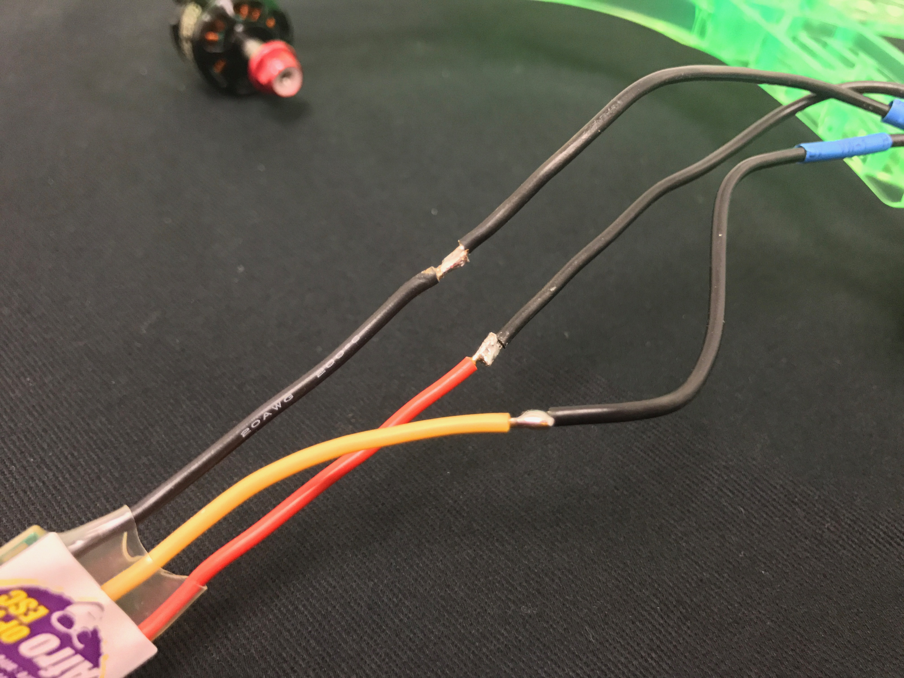

After soldering each motor to its corresponding ESC, move the heatshrink over the solder joint and use a heat gun to shrink it.

## Solder the PDB

Just like the human body has a circulatory system to carry oxygen-rich blood to wherever it is needed, the drone has a power distribution board (PDB) to take the all-important battery power and send it to every component. In this step, you will mount 4 ESCs (electronic speed controllers), a BEC (battery eliminator circuit), a battery lead with XT60 connector, and a battery monitor lead to your PDB (power distribution board). 

### Strip Wires

Cut off all the bullet connectors on the thick wires of the ESC as close to the connector as possible. Leave the PWM signal connector alone.
Strip 0.5 cm from each of the wires you just cut. 

Strip 0.5cm off your battery lead with XT60 connector.

Inside the plastic box labeled, SKYLINE 32, find the battery monitor lead, cut off the two larger connectors, and strip 1cm.

### Tin PDB and Stripped wires.

Tin all 20 ESC leads.
Twist the battery monitor leads around the BEC leads and tin.

Thoroughly tin the battery lead with XT60 connector. It is important that solder flows all the way through the exposed wire. 

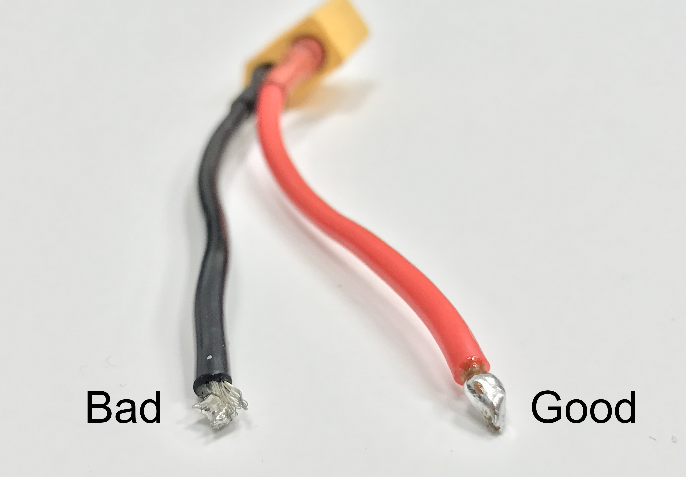

Tin the pads on the PDB as shown. Leave the 5V OUT and 12V OUT pads alone. 

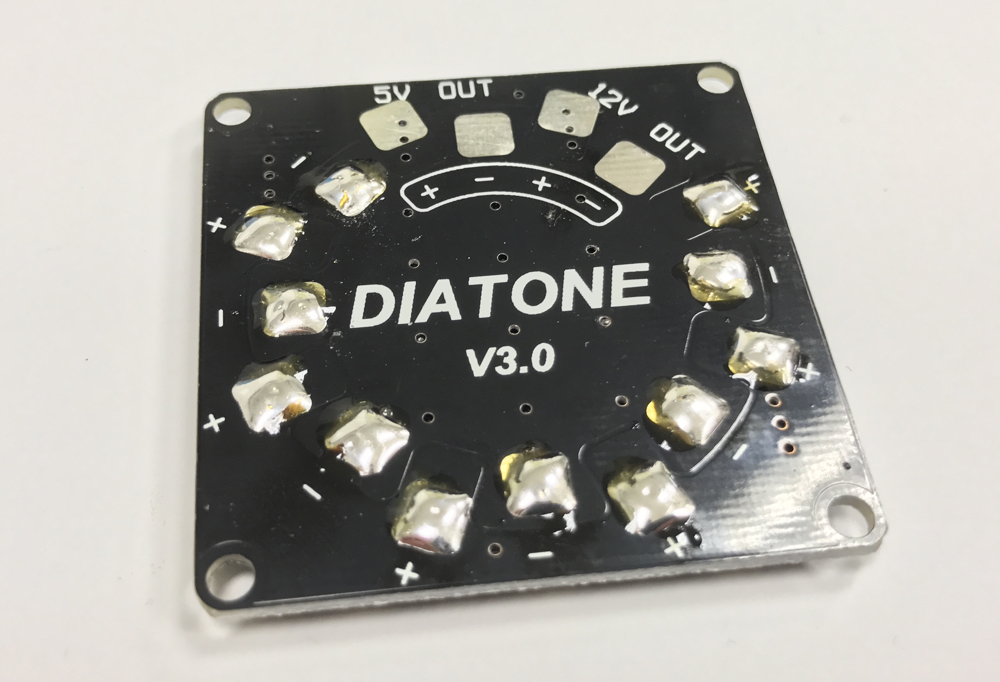

### Connect components to the PDB

Solder the tinned components to the PDB as shown. Make sure Red goes to **+** and black/brown goes to *-*.

## Routing
Now everything has been soldered to the PDB, and you can start worrying about wire management. Route ESC wires nicely with zip ties. There is no single correct way to do this. You just need to ensure that the wires will not be cut by the spinning props. It is best to secure the ESCs and wires underneath the frame. The next several images provide some examples for how you might want to route your wires and ESCs.

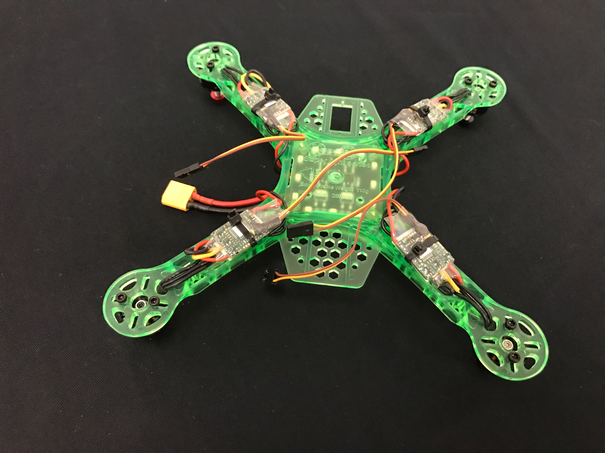

## Camera Attachment
Now you will attach the camera to your frame. Place double-sided sticky tape around the camera, as shown in the picture.

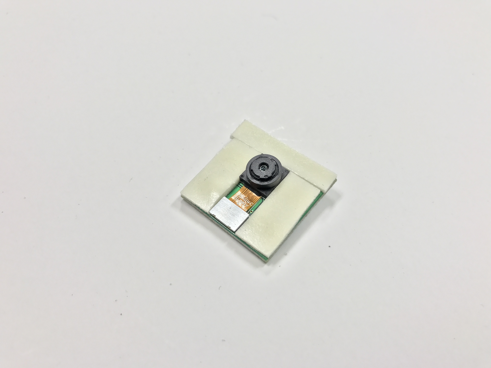

Place the camera through the hole in the back of the frame, as in the picture. Make sure it is straight. 

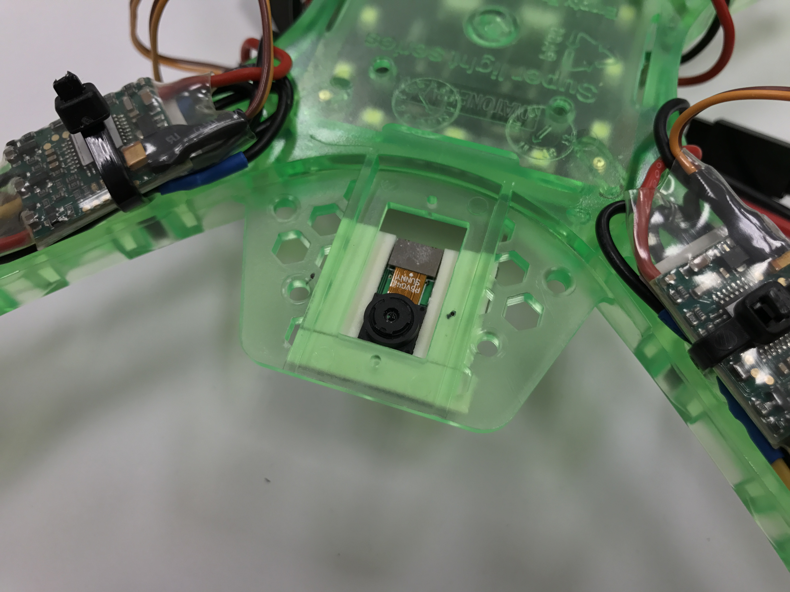

## IR Attachment
Zip tie the IR sensor onto the bottom of the frame's front platform, as in the picture.

