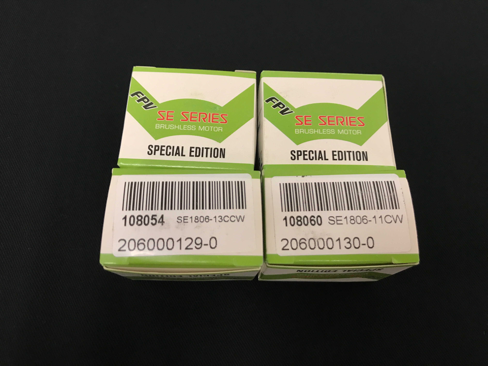
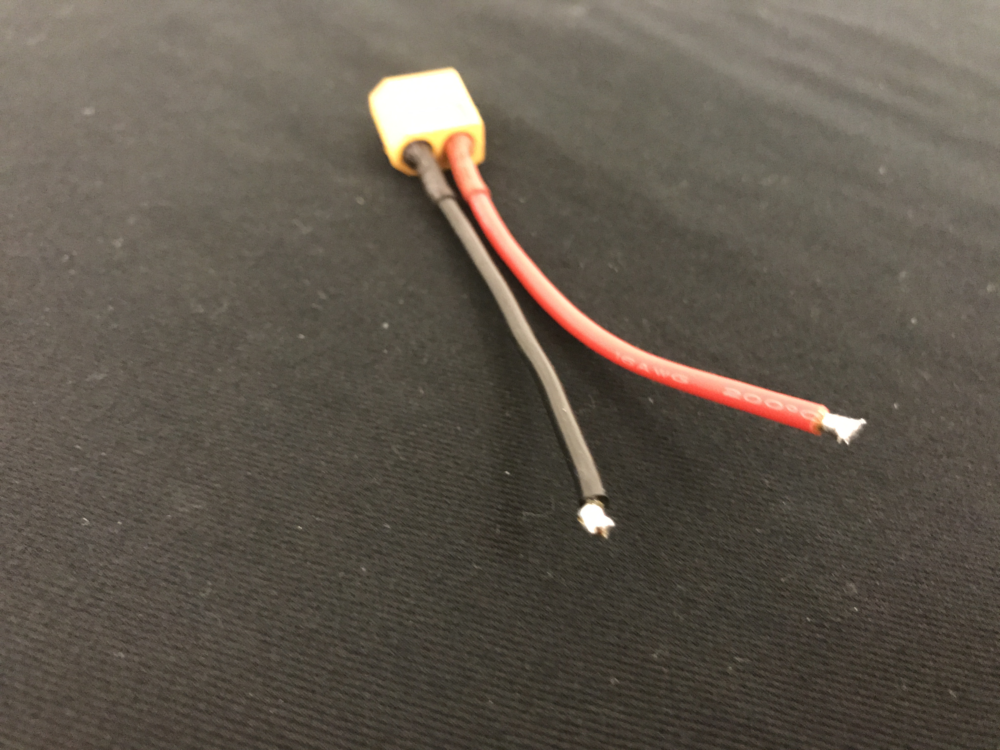
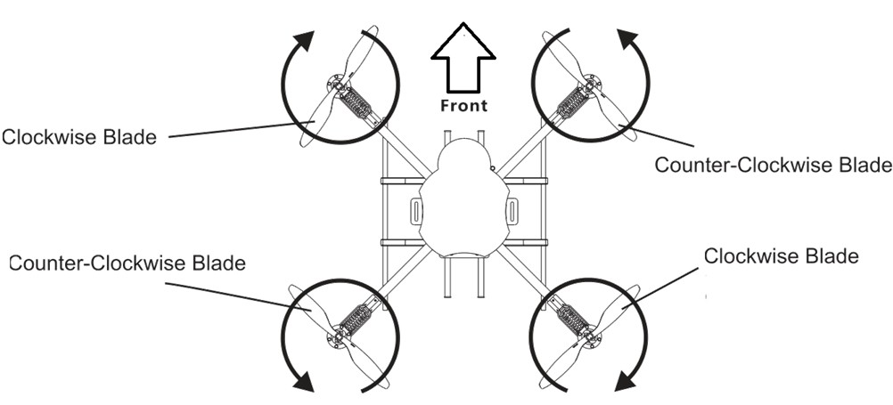
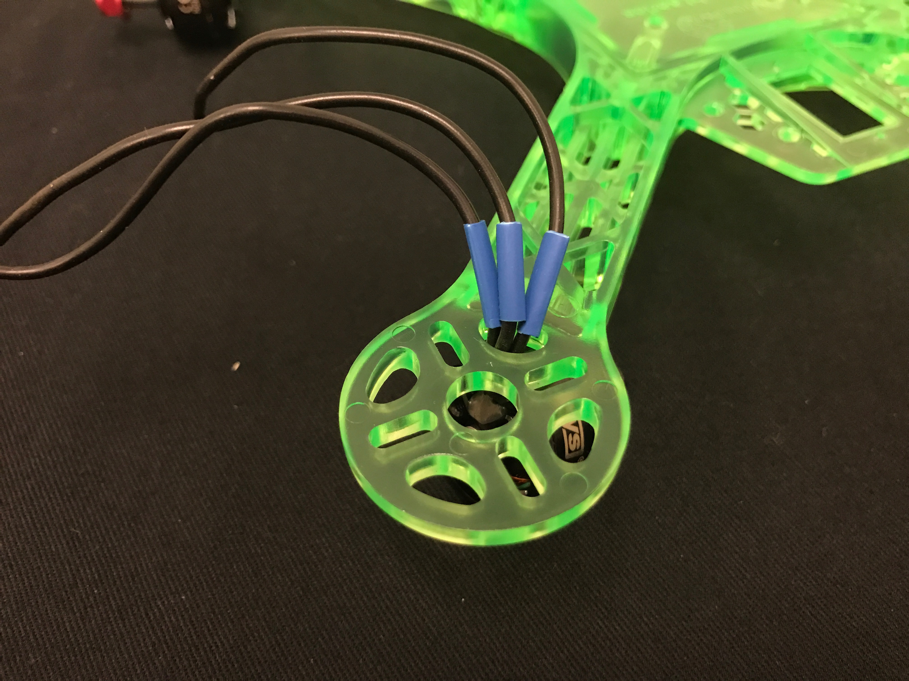
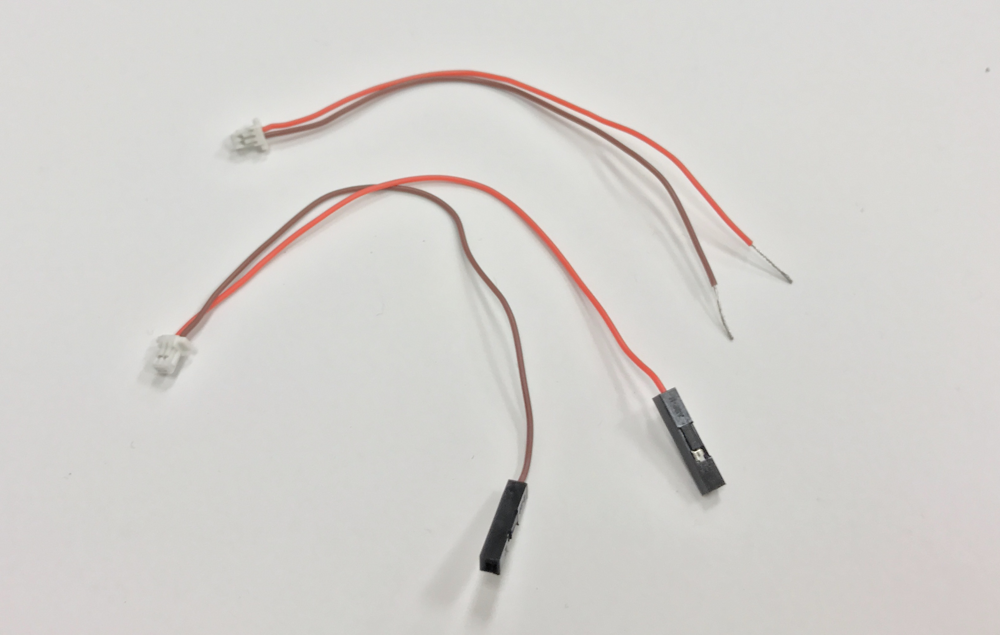
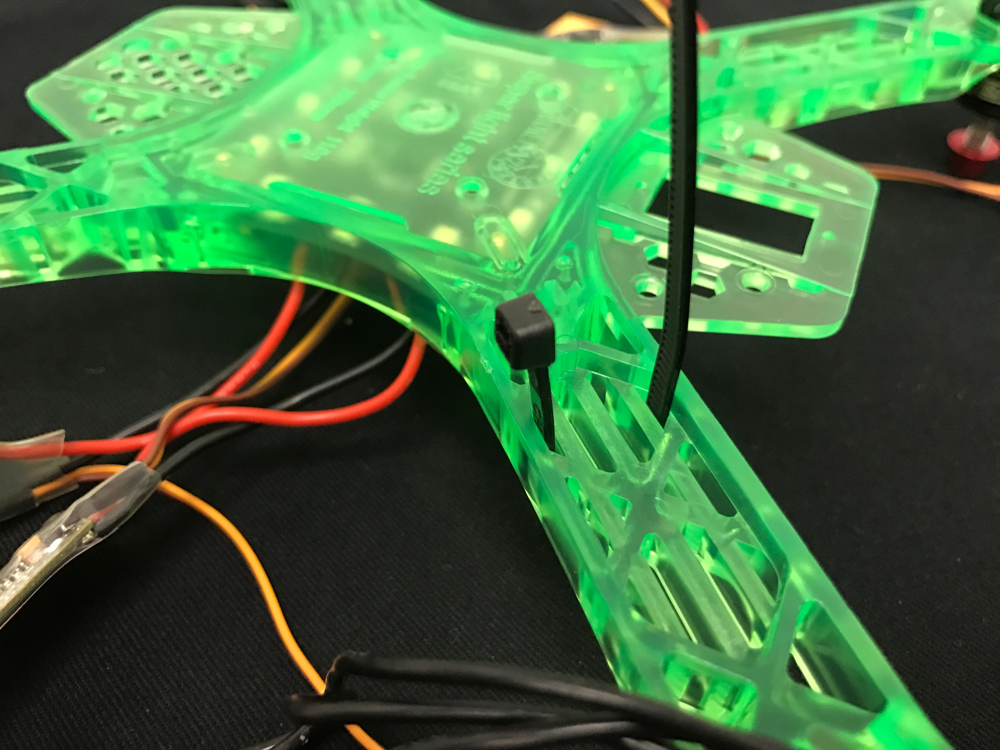
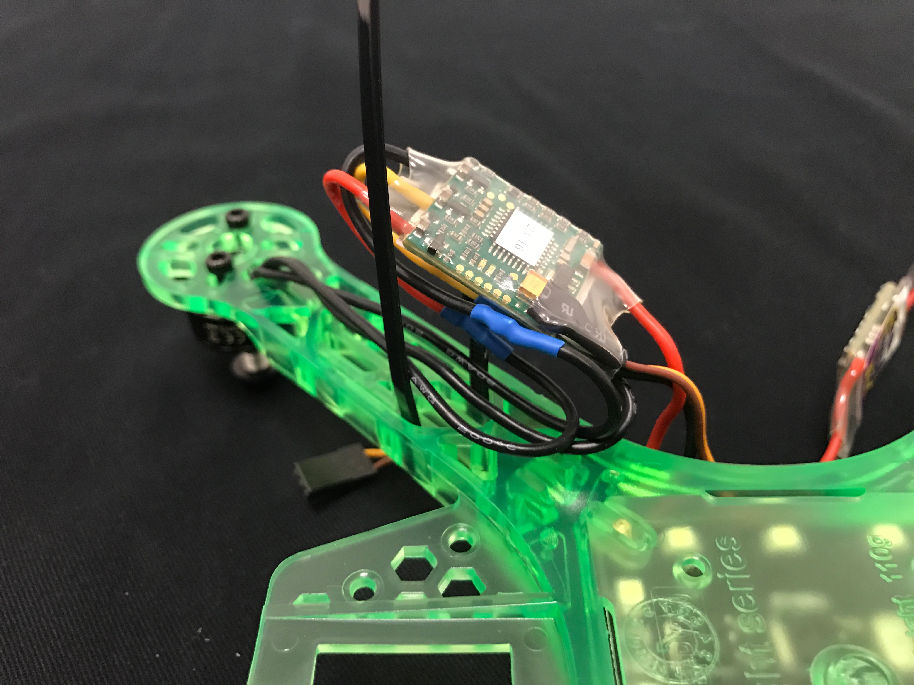
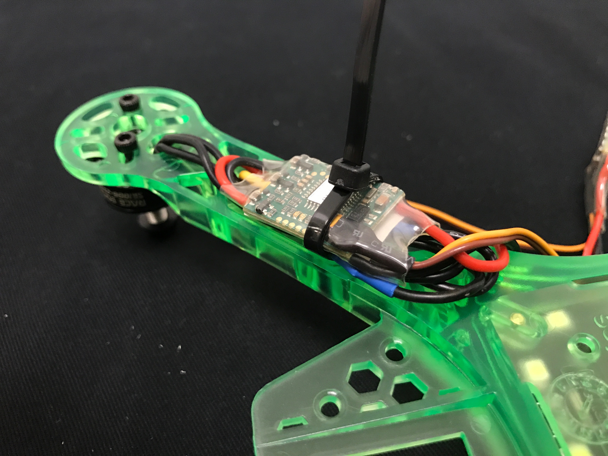

## Hardware Assembly

### Check your components
  Before you start assembling your drone, it's important to make sure you have the right components. For the hardware assembly, you will need:
  
* 4 ESCs (Electronic Speed Controllers). These convert DC power from the battery to [three-phase AC](https://en.wikipedia.org/wiki/Three-phase_electric_power), which drives the motor at the desired speed.

* 4 Motors. These brushless motors are driven by three phase AC (hence the three wires). On the bottom of the boxes, you will notice a part number of the form SE1806-***_XY_***, where ***_X_*** is either 11 or 13, and ***_Y_*** is either CW or CCW. The ***_X_*** refers to the number of coils inside the motor. Make sure all of your motors have the same ***_X_*** so they spin at the same speed. The ***_Y_*** refers to clockwise or counter clockwise. You need two of each.

* 4 Props. Your bag should contain 2 CW and 2 CCW propellers.
TODO: Picture of Props

* 1 frame kit. This is the skeleton of your quadcopter.

* 1 Power Distribution Board (PDB). This lets you distribute power from the battery to the motors and the Raspberry Pi.

* 1 Battery lead. This will let you connect a battery to the PDB.

* 1 Skyline box
TODO: Image of skyline box
* 1 Raspberry Pi
TODO: Image of Pi Box/Pi
* 1 Battery Elimination Circuit (BEC). This is a 5V [switching regulator](https://www.dimensionengineering.com/info/switching-regulators) used to power the Pi.
TODO: Image of BEC
* 1 IR sensor and cable
TODO: Image of IR sensor
* 1 camera and ribbon cable
TODO: Image of camera
* 1 analog to digitial converter
TODO: Image of ADC
* 1 Raspberry Pi mounting bracket
TODO: Image
* 4 standoffs, with 4 M3 bolts

* 3mm heatshrink (cut into 12, 1cm pieces)

* 4 zipties

### Bolt on the Motors
Two of the motors are counter-clockwise threaded and the other two are clockwise threaded. Screw the included nuts that came each motor onto the motor shaft so you don't forget which is which. 

TODO: Add image in next line

The motors with the red nuts will spin counter-clockwise and the black clockwise, so it is critical that they are attached to the correct arms. Image REF shows which side of the frame is the front. The front right motor will spin CCW, and the front left motor will spin CW. Diagonal motors spin in the same direction. The next image shows how the propellers will spin:

In order to ensure the nuts tend to tighten during flight instead of loosen, you want each nut to thread in the opposite direction as its motor spins. For example, this means the front right motor's nut should tighten in the CW direction. When mounting the motors, make sure to route the wire through the hole in the frame to the underside of the frame _before_ bolting on the motor. 

Use two of the long M3 bolts included with the motor and screw them in tightly.

Screw the short M3 bolts into the brass 6mm M3 standoffs.

Use a hex key to screw the standoffs through the PDB into grooves in the frame in the shown orientation. Apply a downward pressure as you are turning to ensure the standoffs bite into the plastic. Be careful not to overtighten the standoffs and strip out the groove.

### Solder ESCs to Motors

Place your 3mm diameter heatshrink tubing cut to 1cm sections onto each of the motor leads.

If you have not done so already, you will need to cut off the connectors on the ends of the ESC wires, and strip the plastic casing. You need to do this for the two input wires and the three output wires, as shown in the picture:

Tin the ESC wires thoroughly if you haven't already. Tin the motor wires as well. (Note: They come pre-tinned, but with a different, higher temperature solder and not quite enough of it)

Solder the ESC wires to the motor wires. It does not matter which ESC wire is connected to which motor wire. However, routing will be easier if you make sure they are not too twisted.

After soldering each motor to its corresponding ESC, move the heatshrink over the solder joint and use a heat gun to shrink it.

### Solder the PDB
Next, you must solder the ESCs to the PDB. Begin by adding a lump of solder to the PDB, as shown in the image:

Then tin the ends of the ESC wires. Now solder the four pairs of ESC wires to the PDB by melting the solder lumps on the PDB and inserting the wire into the melted solder (the red wires go to the + terminals).

You must also solder the battery connector to the PDB. Solder it to one of the free pairs of pads on the PDB, just like you did for the ESCs.

Finally, you need a way to power the Pi. You will attach the The Skyline flight controller needs to know the battery voltage so it can compensate as the battery discharges. In the Skyline box, you will find a plastic connector with a red and black wire in it. You will have to cut off the black connectors, as shown . Attach these wires to the battery connector as shown in the image:. Solder these wires to the PDB as well.

Now everything has been soldered to the PDB, and you can start worrying about wire management. Route ESC wires nicely with zip ties. There is no single correct way to do this. You just need to ensure that the wires will not be cut by the spinning props. It is best to secure the ESCs and wires underneath the frame. The next several images provide some examples for how you might want to route your wires and ESCs.

  9. Flash ESCs (battery required)

  10. Attach the PWM cable to the Skyline

  11. Attach the ESC PWM controls to the Skyline via the cable from 8. RR = 1, FR =
     2, RL = 3, FL = 4

 12. Attach the batery voltage check wire to the Skyline

 13. Use ClearFlight to test the direction of the motors. [see image for correct
         rotation direction. Diagonals spin the same direction]. Mark which motors
             need to be reversed. (battery required)

  14. For each motor that must be reversed, plug in its ESC PWM input to the ESC
      flashing device. Read ESC -> reverse -> write ESC [image(s)] (battery
                  required)

  15. Attach the Skyline to the "front deck" of the frame with double-sided sticky
          tape.

  16. Screw the Pi mounting bracket onto the standoffs on the PDB. Now is a good
              time to make sure the ESC wires are mounted nicely and tucked inside of this
                  mounting bracket [image]

  17. Attach the Pi to the mounting bracket with two screws. The USB port on the
                      Pi should be facing forward

