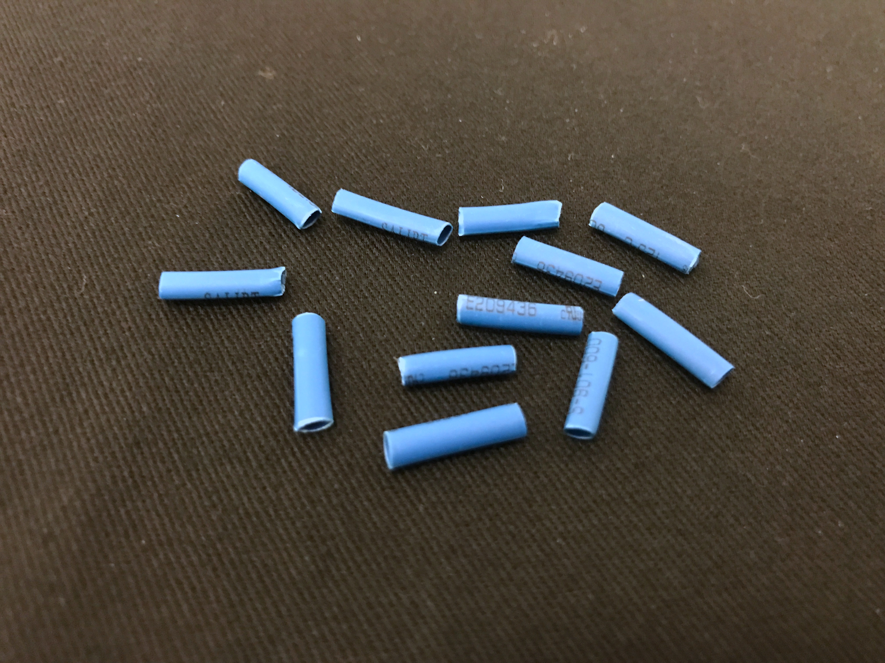
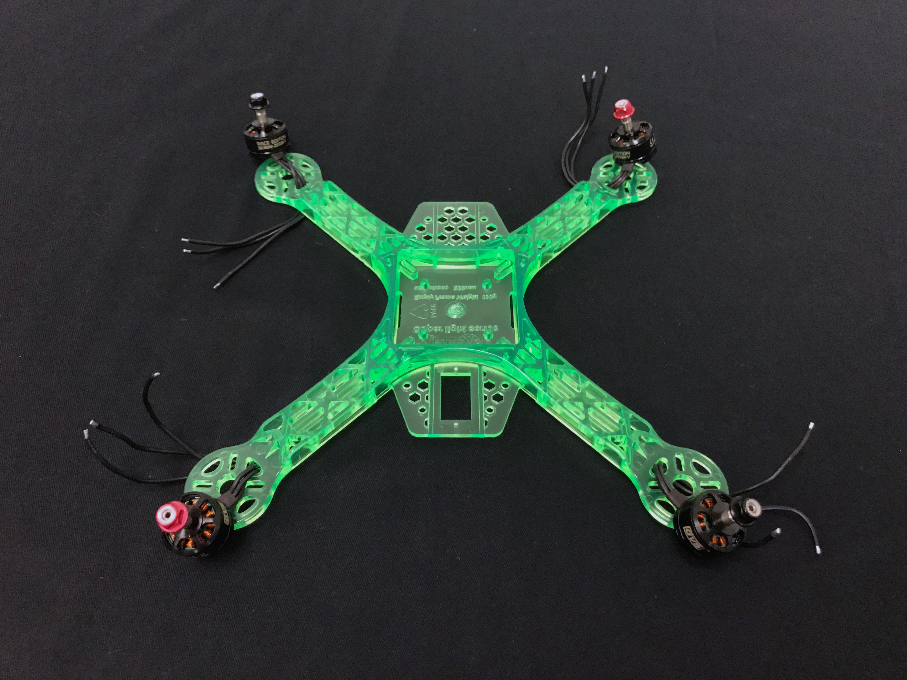
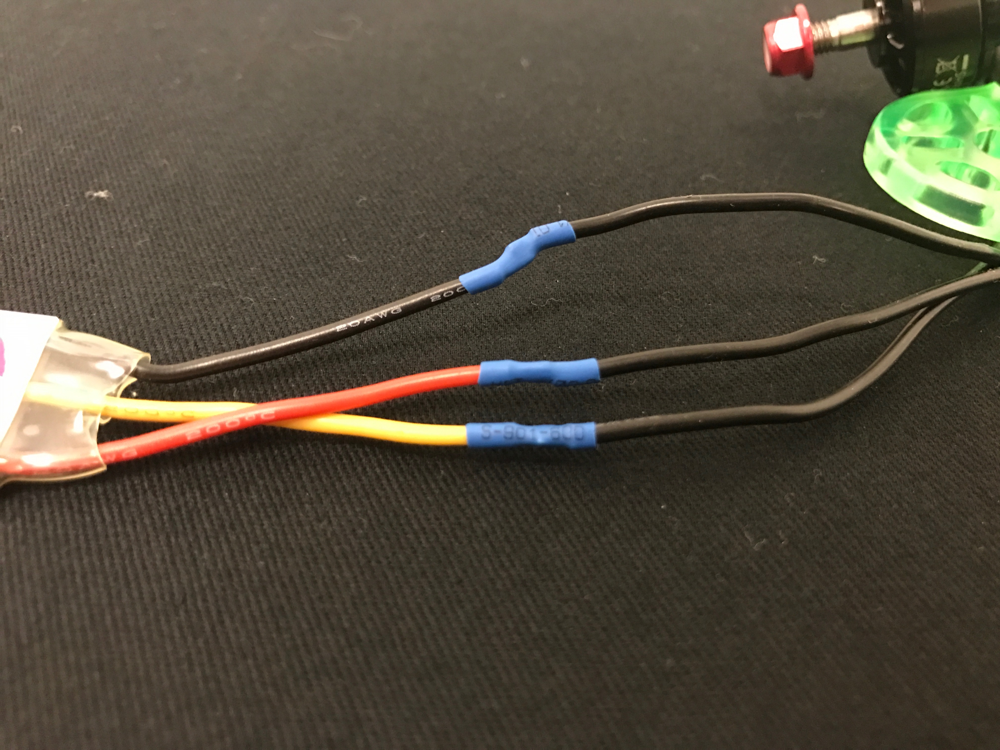
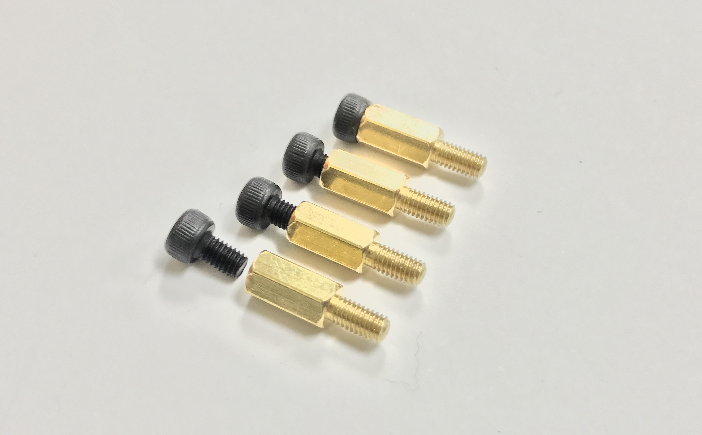

## Hardware Assembly

### Check your components
  Before you start assembling your drone, it's important to make sure you have the right components. For the hardware assembly, you will need:
  
* 4 ESCs (Electronic Speed Controllers). These convert DC power from the battery to three-phase AC, which drives the motor at the desired speed.

* 4 Motors. These brushless motors are driven by three phase AC (hence the three wires). On the bottom of the boxes, you will notice the code SE1806-***_XY_***, where ***_X_*** is either 11 or 13, and ***_Y_*** is either CW or CCW. The ***_X_*** refers to the number of coils inside the motor. Make sure all of your motors have the same ***_X_*** so they spin at the same speed. The ***_Y_*** refers to clockwise or counter clockwise. You need two of each.

* 1 frame kit. This is the skeleton of your quadcopter.

* 4 zipties
* 3mm heatshrink (cut into 12, 1cm pieces)

### Bolt things together
Two of the motors are counter-clockwise threaded and the other two are clockwise threaded. Screw the included nuts that came each motor onto the motor shaft so you don't forget which is which. 

Screw motors into frame as shown. Make sure to route the wire through the hole in the frame to the underside of the frame.

### Solder ESCs to Motors

### Mount PDB and ESCs

  4. Solder each motor to an ESC. Might have to cut off the end of the esc connector to strip the wire.

  5. Attach PDB w/ standoffs

  6. Route ESC wires nicely with zip ties. There is no single correct way to do this. We just need to ensure that the wires will not be cut by the spinning props. It is best to secure the ESCs and wires underneath the frame as in [picture]

  9. Flash ESCs (battery required)

  10. Attach the PWM cable to the Skyline

  11. Attach the ESC PWM controls to the Skyline via the cable from 8. RR = 1, FR =
     2, RL = 3, FL = 4

 12. Attach the batery voltage check wire to the Skyline

 13. Use ClearFlight to test the direction of the motors. [see image for correct
         rotation direction. Diagonals spin the same direction]. Mark which motors
             need to be reversed. (battery required)

  14. For each motor that must be reversed, plug in its ESC PWM input to the ESC
      flashing device. Read ESC -> reverse -> write ESC [image(s)] (battery
                  required)

  15. Attach the Skyline to the "front deck" of the frame with double-sided sticky
          tape.

  16. Screw the Pi mounting bracket onto the standoffs on the PDB. Now is a good
              time to make sure the ESC wires are mounted nicely and tucked inside of this
                  mounting bracket [image]

  17. Attach the Pi to the mounting bracket with two screws. The USB port on the
                      Pi should be facing forward

